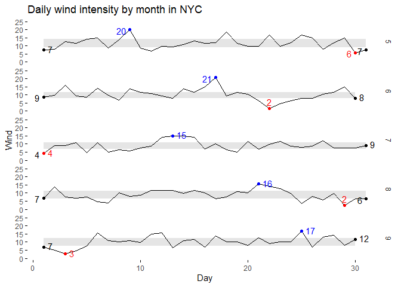

<!-- README.md is generated from README.Rmd. Please edit that file -->

# ggspark

<!-- badges: start -->
<!-- badges: end -->

The goal of ggspark is to help create ggplot2 functions that help with
creating sparkline plots in the style of Edward Tufte, such as this one

<figure>

<figcaption aria-hidden="true">Original sparklines, source Edward
Tufte.</figcaption>
</figure>

Thus, the package has two main functions: `stat_interquartilerange()`
that draws a `geom_ribbon()` between the 1st and 3rd quartile of the
variable in the y axis, and `stat_sparklabels()` that draws points or
text labels in the beginning, min, max, and end points of the variable
in the y axis.

## Installation

You can install the development version of ggspark like so:

``` r
devtools::install_github("marcboschmatas/ggspark")
```

## Example

The `stat_sparklabels()` function needs a colour scale with three
values. The first one will be using for the start and end points of the
line, the second one for the max, and the third one for the min.

``` r
library(ggplot2)
library(ggspark)
ggplot(airquality, aes(Day, Wind, group = Month)) + 
  stat_interquartilerange(geom = "ribbon",
                          show.legend = FALSE) +
  geom_line() + 
  stat_sparklabels(geom = "label",
                   show.legend = FALSE) + 
  scale_colour_manual("", values = c("black", "blue", "red")) + 
  scale_y_continuous(limits = c(0, 25)) + 
  facet_grid(Month~.) +
  ggtitle("Daily wind intensity by month in NYC") +
  theme_minimal() + 
  theme(panel.grid = element_blank(),
        axis.ticks = element_line())
```

 It has an
optional `label_fun` parameter that allows to modify the label
aesthetics (such as rounding, adding percentage or currency suffixes and
prefixes…).

``` r
library(ggplot2)
library(ggspark)
ggplot(airquality, aes(Day, Wind, group = Month)) + 
  stat_interquartilerange(geom = "ribbon",
                          show.legend = FALSE) +
  geom_line() + 
  stat_sparklabels(geom = "label", label_fun = \(x) round(x, 0),
                   show.legend = FALSE) + 
  scale_colour_manual("", values = c("black", "blue", "red")) + 
  scale_y_continuous(limits = c(0, 25)) + 
  facet_grid(Month~.) +
  ggtitle("Daily wind intensity by month in NYC") +
  theme_minimal() + 
  theme(panel.grid = element_blank(),
        axis.ticks = element_line())
```


It is also possible to use points instead of labels.

``` r
library(ggrepel)
#> Warning: package 'ggrepel' was built under R version 4.3.3
ggplot(airquality, aes(Day, Wind, group = Month)) + 
  stat_interquartilerange(geom = "ribbon",
                          show.legend = FALSE) +
  geom_line() + 
  stat_sparklabels(geom = "point",
                   show.legend = FALSE) + 
  scale_colour_manual("", values = c("black", "blue", "red")) + 
  scale_y_continuous(limits = c(0, 25)) + 
  facet_grid(Month~.) +
  ggtitle("Daily wind intensity by month in NYC") +
  theme_minimal() + 
  theme(panel.grid = element_blank(),
        axis.ticks = element_line())
```


With ggrepel, it is possible to combine both text and dots.

``` r
library(ggrepel)
ggplot(airquality, aes(Day, Wind, group = Month)) + 
  stat_interquartilerange(geom = "ribbon",
                          show.legend = FALSE) +
  geom_line() + 
  stat_sparklabels(geom = "point", label_fun = \(x) round(x, 0),
                   show.legend = FALSE) + 
    stat_sparklabels(geom = "text_repel", label_fun = \(x) round(x, 0),
                   show.legend = FALSE) + 
  scale_colour_manual("", values = c("black", "blue", "red")) + 
  scale_y_continuous(limits = c(0, 25)) + 
  facet_grid(Month~.) +
  ggtitle("Daily wind intensity by month in NYC") +
  theme_minimal() + 
  theme(panel.grid = element_blank(),
        axis.ticks = element_line())
```


